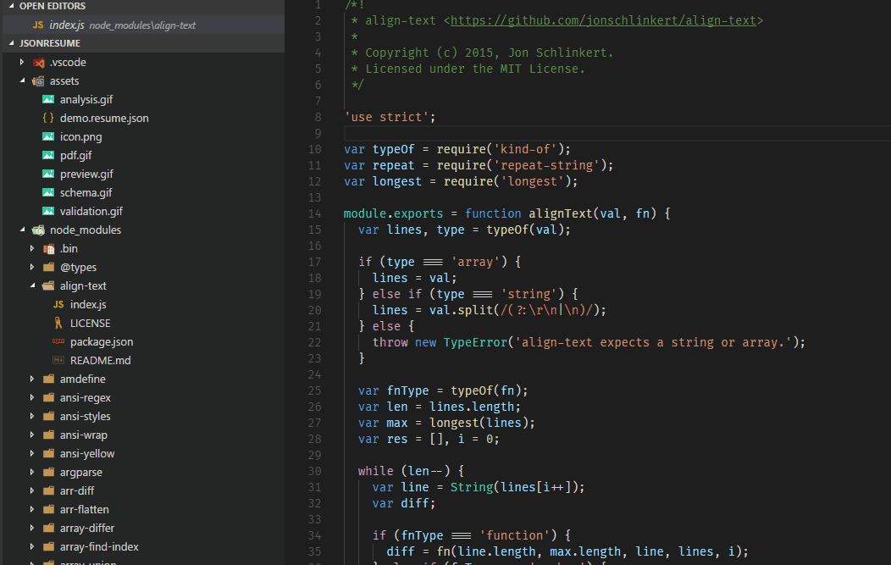

# VSCode image-viewer README

This simple extension allows you to view images from the comfort of your VS Code instance!

## Features

Picture is worth a thousand words, so here's the extension in action:

## Release Notes

Users appreciate release notes as you update your extension.

### 0.0.1

Initial release

Icons made by [Freepik](http://www.freepik.com "Freepik") from [www.flaticon.com](https://www.flaticon.com/ "Flaticon") is licensed by [CC 3.0 BY](http://creativecommons.org/licenses/by/3.0/ "Creative Commons BY 3.0")